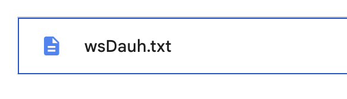
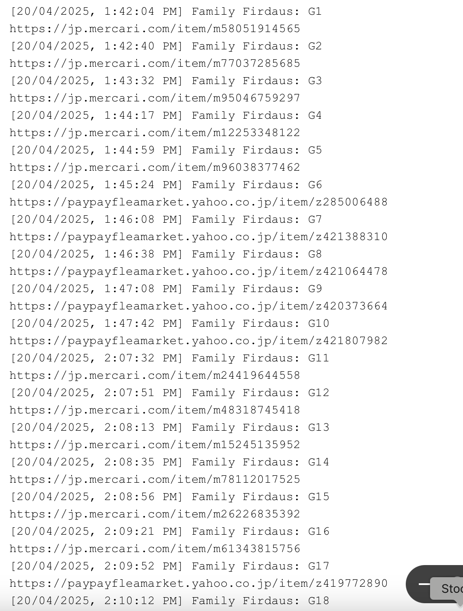
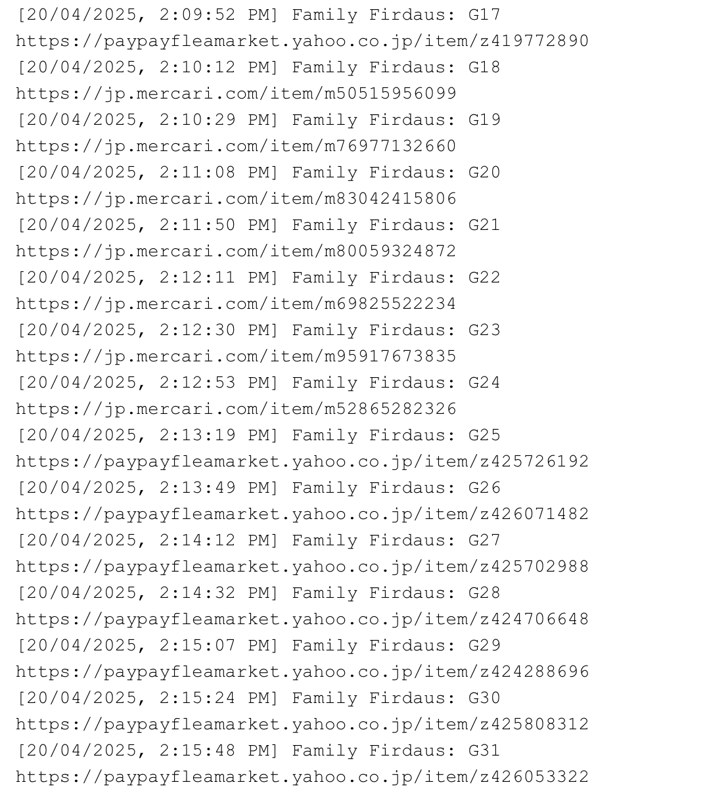

# 📌 Project Objective

## ✅ 1. What Data Is Being Extracted?

In this project, the goal is to extract specific labeled data from a WhatsApp chat.  
For example, in the chat file, data entries such as `G1` to `G31` are present.  
The script will extract each of these entries and log them into a **Google Sheet**,  
with values placed into predefined columns accordingly.

---

## ✅ 2. Input File: `wsDauh.txt`

The WhatsApp chat export file should be named `wsDauh.txt` and uploaded to your Google Drive folder.

---

## ✅ 3. Sample Data to Extract (e.g., G1 ~ G31)

Below are examples of the data format being extracted from the chat file:

  

