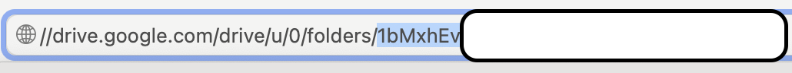
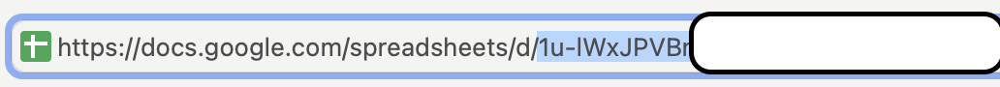
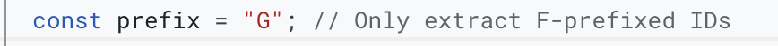
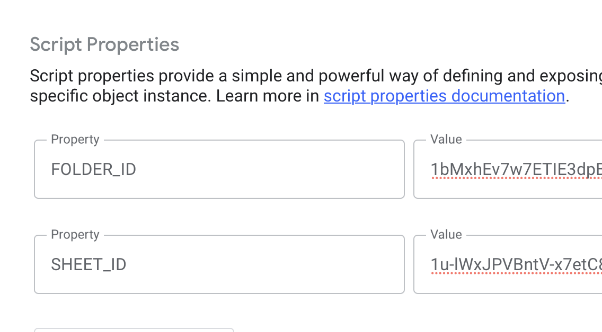
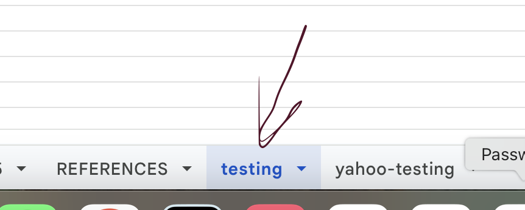
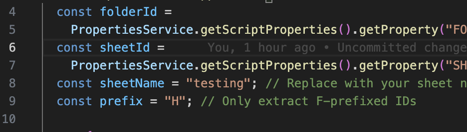

# 🧭 Step-by-Step Guide

## ✅ 1. Locate Your **Folder ID**

After extracting your `ws.txt` file from WhatsApp, upload it to a folder in Google Drive.  
The **Folder ID** is the string that comes **after `folders/`** in the Drive URL. 
→ https://drive.google.com/drive/folders/[your-folder-id]

## ✅ 2. Locate Your **Sheet ID**

The **Sheet ID** refers to the Google Sheet where your data will be saved.  
It appears **after `/d/` and before `/edit`** in the Sheet URL. 
→ https://docs.google.com/spreadsheets/d/[your-sheet-id]/edit

## ✅ 3. Set Your **Desired Prefix**

In this example, we extract data with the prefix `G`.  
This will include all entries from `G1` to `G[end]`.

---

## ✅ 4. Update Your **Script Properties** with IDs

Add your `Sheet ID` and `Folder ID` inside the **Google Apps Script** project properties.

---

## ✅ 5. Specify Your **Sheet Name**

Make sure that the sheet name in your script matches the actual tab name in your Google Sheet.

  

